# Design Document: Clinical Evidence Drift & Consensus Monitoring System

## Overview

### What This System Does

This system monitors medical research trends by:
- Collecting research papers from PubMed (a public medical database)
- Using Amazon Bedrock AI to extract structured information from abstracts
- Calculating scores that show how much studies agree or disagree
- Detecting early warning signs when medical consensus might be changing
- Comparing research timelines with real-world treatment usage
- Displaying results in a simple web dashboard

### What This System Does NOT Do

**CRITICAL DISCLAIMER**: This is a research monitoring tool only. It does NOT:
- Diagnose medical conditions
- Recommend treatments to patients
- Replace clinical judgment
- Use individual patient data
- Make healthcare decisions

This tool helps researchers and healthcare professionals track trends in published medical literature.

## Architecture

### High-Level System Architecture

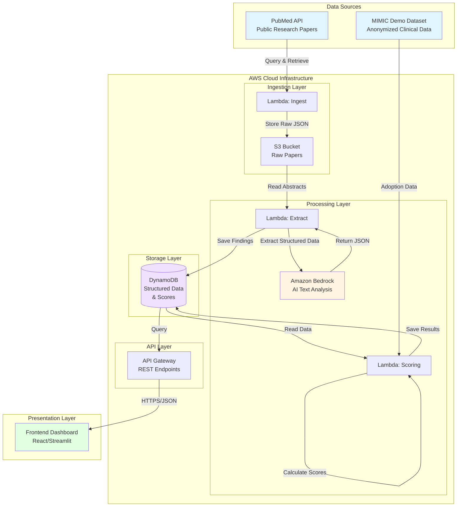

### Detailed Data Flow Pipeline

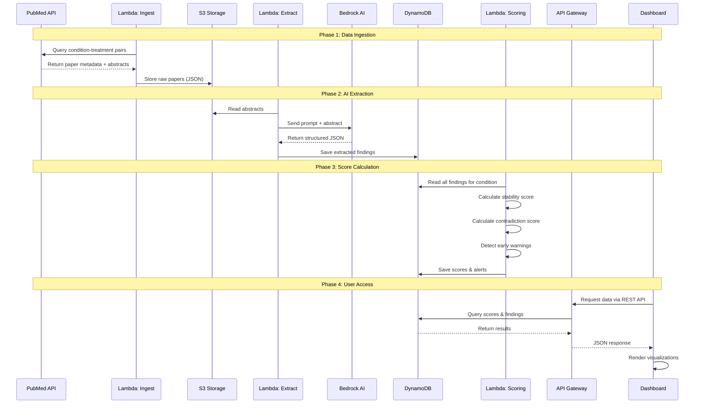

### AWS Components

| Component | Purpose | Data Stored |
|-----------|---------|-------------|
| **PubMed API** | Source of research papers (public database) | N/A (External) |
| **AWS Lambda** | Serverless functions for data processing | N/A (Stateless) |
| **Amazon S3** | Stores raw research paper abstracts | JSON files with paper metadata |
| **Amazon Bedrock** | AI service that extracts structured data from text | N/A (Stateless) |
| **DynamoDB** | NoSQL database for structured research data and scores | Findings, scores, alerts |
| **API Gateway** | REST API endpoints for frontend | N/A (Stateless) |
| **Frontend** | React or Streamlit dashboard for visualization | N/A (Client-side) |
| **Amazon Q** | AI assistant used during development for code generation | N/A (Dev Tool) |

## Components and Interfaces

### Component Breakdown

```
┌─────────────────────────────────────────────────────────────────┐
│                        PRESENTATION LAYER                        │
├─────────────────────────────────────────────────────────────────┤
│  Dashboard UI (React/Streamlit)                                 │
│  - Stability Score Gauges                                       │
│  - Contradiction Charts                                         │
│  - Timeline Visualizations                                      │
│  - Early Warning Alerts                                         │
│  - Citation Links                                               │
└────────────────────────┬────────────────────────────────────────┘
                         │ HTTPS/REST
┌────────────────────────┴────────────────────────────────────────┐
│                          API LAYER                               │
├─────────────────────────────────────────────────────────────────┤
│  API Gateway                                                     │
│  Endpoints:                                                      │
│  - GET /conditions                                              │
│  - GET /conditions/{id}/scores                                  │
│  - GET /warnings                                                │
│  - GET /papers/{pubmed_id}                                      │
└────────────────────────┬────────────────────────────────────────┘
                         │ Lambda Invocation
┌────────────────────────┴────────────────────────────────────────┐
│                       PROCESSING LAYER                           │
├─────────────────────────────────────────────────────────────────┤
│  ┌──────────────┐  ┌──────────────┐  ┌──────────────┐         │
│  │   Lambda:    │  │   Lambda:    │  │   Lambda:    │         │
│  │   Ingest     │  │   Extract    │  │   Scoring    │         │
│  │              │  │              │  │              │         │
│  │ - Query PM   │  │ - Read S3    │  │ - Calculate  │         │
│  │ - Validate   │  │ - Call BR    │  │ - Detect     │         │
│  │ - Store S3   │  │ - Save DB    │  │ - Alert      │         │
│  └──────────────┘  └──────┬───────┘  └──────────────┘         │
│                            │                                     │
│                     ┌──────┴───────┐                           │
│                     │   Amazon     │                           │
│                     │   Bedrock    │                           │
│                     │              │                           │
│                     │ - Claude 3   │                           │
│                     │ - Extract    │                           │
│                     └──────────────┘                           │
└────────────────────────┬────────────────────────────────────────┘
                         │ Read/Write
┌────────────────────────┴────────────────────────────────────────┐
│                        STORAGE LAYER                             │
├─────────────────────────────────────────────────────────────────┤
│  ┌──────────────┐                    ┌──────────────┐          │
│  │      S3      │                    │  DynamoDB    │          │
│  │              │                    │              │          │
│  │ Raw Papers   │                    │ Tables:      │          │
│  │ (JSON)       │                    │ - Papers     │          │
│  │              │                    │ - Findings   │          │
│  │              │                    │ - Scores     │          │
│  │              │                    │ - Alerts     │          │
│  └──────────────┘                    └──────────────┘          │
└─────────────────────────────────────────────────────────────────┘
```

### Interface Definitions

#### 1. PubMed API → Lambda (Ingest)

**Request:**
```
GET https://eutils.ncbi.nlm.nih.gov/entrez/eutils/esearch.fcgi
Parameters:
  - db: pubmed
  - term: "Type 2 Diabetes AND Metformin"
  - retmax: 100
  - sort: relevance
```

**Response:**
```json
{
  "idlist": ["12345678", "87654321", ...],
  "count": 100
}
```

#### 2. Lambda (Ingest) → S3

**Stored Object:**
```json
{
  "pubmed_id": "12345678",
  "title": "Efficacy of Metformin in Type 2 Diabetes",
  "authors": ["Smith J", "Doe A"],
  "publication_date": "2024-03-15",
  "abstract": "This randomized controlled trial...",
  "doi": "10.1234/example",
  "journal": "JAMA",
  "retrieved_at": "2024-12-01T10:30:00Z"
}
```

**S3 Path:** `s3://clinical-evidence/raw-papers/{condition}/{pubmed_id}.json`

#### 3. Lambda (Extract) → Amazon Bedrock

**Request:**
```json
{
  "modelId": "anthropic.claude-3-sonnet-20240229-v1:0",
  "messages": [
    {
      "role": "user",
      "content": "Extract structured data from this abstract: [ABSTRACT]"
    }
  ],
  "inferenceConfig": {
    "temperature": 0.1,
    "maxTokens": 1000
  }
}
```

**Response:**
```json
{
  "condition": "Type 2 Diabetes",
  "treatment": "Metformin",
  "outcome": "Reduced HbA1c by 1.2%",
  "direction": "positive",
  "study_type": "RCT",
  "sample_size": 500,
  "confidence": "high"
}
```

#### 4. Lambda (Extract) → DynamoDB

**Table: Papers**
```
PK: pubmed_id (String)
SK: condition#treatment (String)
Attributes:
  - title
  - authors
  - publication_date
  - abstract
  - doi
```

**Table: Findings**
```
PK: condition#treatment (String)
SK: pubmed_id#timestamp (String)
Attributes:
  - outcome
  - direction (positive/negative/neutral)
  - study_type
  - sample_size
  - confidence
  - extracted_at
```

#### 5. Lambda (Scoring) → DynamoDB

**Table: Scores**
```
PK: condition#treatment (String)
SK: date (String, YYYY-MM-DD)
Attributes:
  - stability_score (Number, 0-100)
  - contradiction_score (Number, 0-100)
  - stability_zone (String)
  - paper_count (Number)
  - calculated_at (Timestamp)
```

**Table: Alerts**
```
PK: condition#treatment (String)
SK: alert_id (String, UUID)
Attributes:
  - alert_type (String)
  - severity (String)
  - message (String)
  - triggered_at (Timestamp)
  - is_active (Boolean)
```

#### 6. API Gateway → Frontend

**GET /conditions/{id}/scores**

**Response:**
```json
{
  "condition": "Type 2 Diabetes",
  "treatment": "Metformin",
  "stability_score": 85,
  "contradiction_score": 15,
  "stability_zone": "Stable",
  "paper_count": 47,
  "last_updated": "2024-12-01",
  "trend": {
    "6_months_ago": 88,
    "3_months_ago": 86,
    "current": 85
  },
  "citations": [
    {
      "pubmed_id": "12345678",
      "title": "Efficacy of Metformin...",
      "url": "https://pubmed.ncbi.nlm.nih.gov/12345678"
    }
  ]
}
```

## Data Flow Design

### Step 1: Data Ingestion

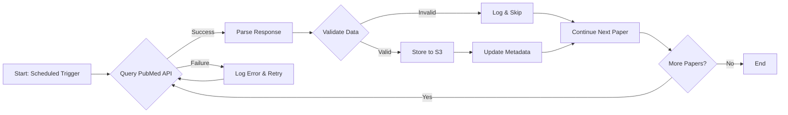

**Process:**
1. Lambda function queries PubMed API for specific condition-treatment pairs
2. Retrieves paper metadata: title, authors, publication date, abstract, PubMed ID
3. Validates data completeness
4. Saves raw data to S3 as JSON files
5. Logs success/failure metrics

**Example condition-treatment pairs:**
- Type 2 Diabetes + Metformin
- Hypertension + ACE Inhibitors
- Depression + SSRIs

**Error Handling:**
- Retry failed requests up to 3 times
- Log all errors to CloudWatch
- Continue processing remaining papers
- Alert admin if >20% failure rate

### Step 2: AI Processing with Amazon Bedrock

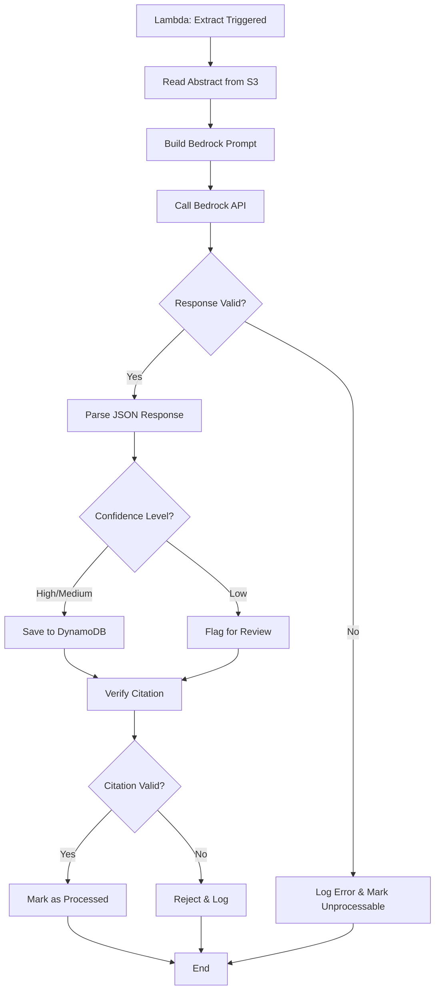

**Process:**
1. Lambda reads abstracts from S3
2. Sends each abstract to Amazon Bedrock with a structured prompt
3. Bedrock extracts key information and returns JSON
4. Validates response and confidence level
5. Verifies PubMed citation exists
6. Saves to DynamoDB if valid

**What Bedrock extracts:**
- Condition (e.g., "Type 2 Diabetes")
- Treatment (e.g., "Metformin")
- Outcome (e.g., "Reduced HbA1c by 1.2%")
- Direction: Positive, Negative, or Neutral
- Study Type: RCT, Meta-analysis, Observational
- Sample Size: Number of participants
- Confidence: High, Medium, Low

**Example output:**
```json
{
  "pubmed_id": "12345678",
  "condition": "Type 2 Diabetes",
  "treatment": "Metformin",
  "outcome": "Reduced HbA1c by 1.2%",
  "direction": "positive",
  "study_type": "RCT",
  "sample_size": 500,
  "confidence": "high",
  "publication_date": "2024-03-15"
}
```

**Saved to DynamoDB** for fast querying.

### Step 3: Scoring Engine

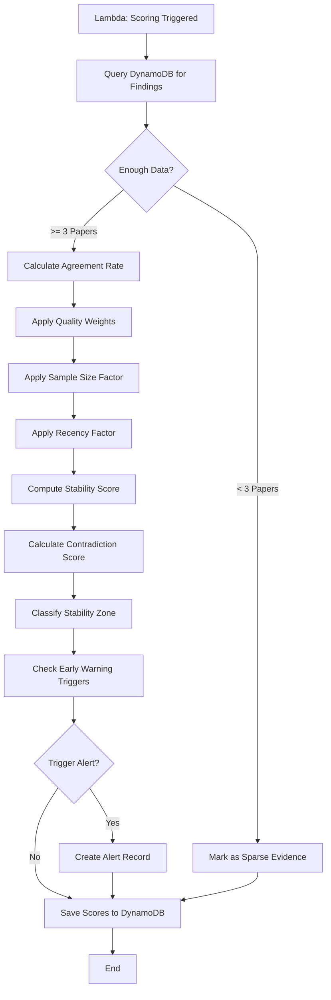

**Process:**
1. Lambda reads structured data from DynamoDB
2. Calculates scores using custom logic (NOT Bedrock)
3. Saves results back to DynamoDB

**Scores calculated:**

#### Evidence Stability Score (0-100)

**Visual Representation:**
```
Score Range:  0────────25────────50────────75────────100
              │         │         │         │         │
Zone:         Sparse    High      Emerging  Stable    Stable
              Evidence  Conflict  Shift
              
Color Code:   🔴 Red   🟠 Orange 🟡 Yellow  🟢 Green
```

- Measures how consistently studies agree
- Higher = more agreement
- Formula considers: study agreement rate, quality weight, sample size, recency

**Formula:**
```
Stability Score = (Agreement% × QualityWeight × RecencyFactor × SampleSizeFactor)

Where:
  Agreement% = (Papers with same direction) / (Total papers)
  QualityWeight = Weighted average based on study type
    - RCT: 1.0
    - Meta-analysis: 1.2
    - Observational: 0.7
  RecencyFactor = Papers in last 2 years weighted higher
  SampleSizeFactor = log(average_sample_size) / 10
```

#### Contradiction Score (0-100)

**Visual Representation:**
```
Score Range:  0────────25────────50────────75────────100
              │         │         │         │         │
Conflict:     Low       Moderate  High      Very High Critical
              
Color Code:   🟢 Green  🟡 Yellow 🟠 Orange  🔴 Red
```

- Measures disagreement between studies
- Higher = more conflict
- Formula considers: disagreement rate, quality of conflicting studies

**Formula:**
```
Contradiction Score = (Disagreement% × QualityOfConflicts) × 100

Where:
  Disagreement% = (Papers with opposite direction) / (Total papers)
  QualityOfConflicts = Average quality weight of conflicting papers
```

#### Stability Zone Classification

```
┌─────────────────────────────────────────────────────────┐
│  Decision Tree for Stability Zone Classification        │
└─────────────────────────────────────────────────────────┘

                    Start
                      │
                      ▼
              ┌───────────────┐
              │ Paper Count?  │
              └───────┬───────┘
                      │
        ┌─────────────┼─────────────┐
        │             │             │
      < 5           5-10          > 10
        │             │             │
        ▼             ▼             ▼
   ┌─────────┐  ┌─────────┐  ┌─────────┐
   │ SPARSE  │  │ Check   │  │ Check   │
   │EVIDENCE │  │ Score   │  │ Score   │
   └─────────┘  └────┬────┘  └────┬────┘
                     │             │
              ┌──────┴──────┐      │
              │             │      │
            < 60          > 60     │
              │             │      │
              ▼             ▼      ▼
         ┌─────────┐  ┌─────────┐ │
         │  HIGH   │  │ Check   │ │
         │CONFLICT │  │ Trend   │ │
         └─────────┘  └────┬────┘ │
                           │      │
                    ┌──────┴──┐   │
                    │         │   │
                Stable    Rising  │
                    │         │   │
                    ▼         ▼   ▼
               ┌─────────┐ ┌─────────┐
               │ STABLE  │ │EMERGING │
               │         │ │  SHIFT  │
               └─────────┘ └─────────┘
```

**Classification Rules:**
- **Stable**: Score > 80
- **Emerging Shift**: Score 60-80 with rising contradictions
- **High Conflict**: High contradiction score
- **Sparse Evidence**: Fewer than 5 studies

**Example:**
- 8 of 10 studies positive → 80% agreement
- 6 are RCTs → Quality boost
- Average sample size 500 → Moderate
- Published in last 3 years → High recency
- **Final Score: 85 (Stable)**

### Step 4: Early Warning Detection

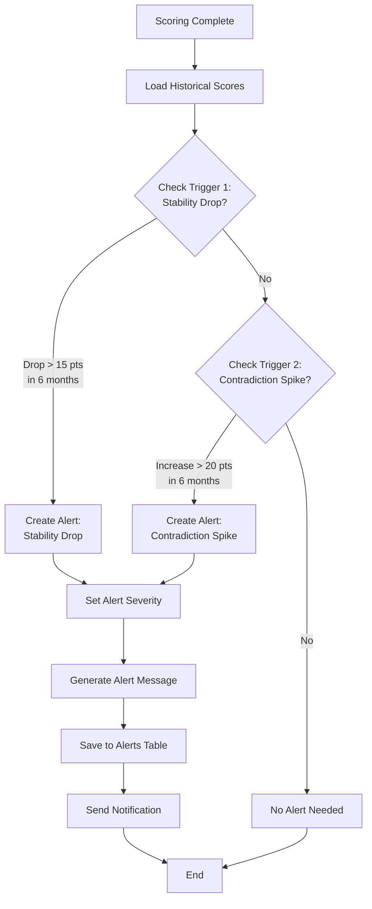

**Process:**
Lambda analyzes score trends and triggers alerts when:

1. **Rapid Stability Drop**: Stability score drops >15 points in 6 months
2. **Contradiction Spike**: Contradiction score increases >20 points in 6 months

**For MVP, we focus on these 2 triggers only.**

**Alert Severity Levels:**
```
┌──────────────────────────────────────────────────────┐
│  Severity Matrix                                     │
├──────────────────────────────────────────────────────┤
│                                                      │
│  Score Change    │  Severity  │  Color  │  Action   │
│  ───────────────────────────────────────────────────│
│  15-25 points    │  LOW       │  🟡     │  Monitor  │
│  25-35 points    │  MEDIUM    │  🟠     │  Review   │
│  > 35 points     │  HIGH      │  🔴     │  Alert    │
│                                                      │
└──────────────────────────────────────────────────────┘
```

**Example alert:**
```
⚠️ EARLY WARNING - MEDIUM SEVERITY
━━━━━━━━━━━━━━━━━━━━━━━━━━━━━━━━━━━━━━━━━━━━━━━━━━━━━━

Condition: Type 2 Diabetes
Treatment: Metformin

Alert Type: Stability Drop
Triggered: 2024-12-01

Details:
  • Stability score dropped from 85 → 68 (17 point drop)
  • Time period: Last 6 months
  • Contributing factors: 3 new RCTs show conflicting results

Recent Papers:
  1. Smith et al. (2024) - Negative outcome [PubMed: 12345678]
  2. Jones et al. (2024) - Neutral outcome [PubMed: 87654321]
  3. Brown et al. (2024) - Negative outcome [PubMed: 11223344]

Recommendation: Review recent literature for emerging trends

━━━━━━━━━━━━━━━━━━━━━━━━━━━━━━━━━━━━━━━━━━━━━━━━━━━━━━
⚠️ This is an informational alert only. It does not 
   imply clinical action or treatment changes.
━━━━━━━━━━━━━━━━━━━━━━━━━━━━━━━━━━━━━━━━━━━━━━━━━━━━━━
```

**Timeline Visualization:**
```
Stability Score Over Time
100 ┤                                    
 90 ┤  ●───●───●                         
 80 ┤           ╲                        
 70 ┤            ●───●                   
 60 ┤                 ╲                  
 50 ┤                  ●  ← Current      
    └─────────────────────────────────
     Jan  Mar  May  Jul  Sep  Nov
     2024 2024 2024 2024 2024 2024
     
     ⚠️ Alert triggered: 17 point drop in 6 months
```

### Step 5: Adoption Lag Calculation

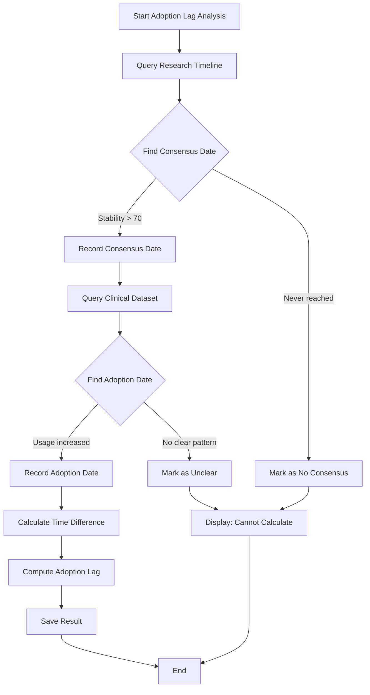

**Process:**
1. Identify when research consensus was reached (stability score crossed 70)
2. Identify when treatment usage increased in public clinical datasets
3. Calculate time difference

**Visual Timeline:**
```
Research & Adoption Timeline
━━━━━━━━━━━━━━━━━━━━━━━━━━━━━━━━━━━━━━━━━━━━━━━━━━━━━━━━━━━━━━━━━━

Research Phase:
2018 ────────────────────────────────────────────────────────────
     │
     │  First positive RCT published
     ▼
2019 ●───────────────────────────────────────────────────────────
     │
     │  Multiple confirmatory studies
     │  Stability score rising
     ▼
2020 ●───────────────────────────────────────────────────────────
     │                                    ▲
     │  Stability score crosses 70        │
     │  CONSENSUS REACHED ✓               │  Adoption Lag
     ▼                                    │  = 30 months
2021 ●───────────────────────────────────────────────────────────
     │                                    │
     │  Guidelines updated                │
     │                                    │
     ▼                                    │
2022 ────────────────────────────────────────────────────────────
     │                                    │
     │  Clinical adoption begins          │
     │  Usage increases 50%               ▼
     ▼
2023 ●───────────────────────────────────────────────────────────
     │
     │  Widespread adoption
     ▼
2024 ────────────────────────────────────────────────────────────

Legend:
  ● = Milestone event
  ▲▼ = Adoption lag measurement
```

**Data source:**
- MIMIC-III Demo dataset (anonymized ICU data) OR synthetic data
- Population-level aggregated data only
- No individual patient records

**Example:**
```
┌─────────────────────────────────────────────────────┐
│  Adoption Lag Analysis                              │
├─────────────────────────────────────────────────────┤
│                                                     │
│  Condition: Type 2 Diabetes                         │
│  Treatment: Metformin                               │
│                                                     │
│  Research Consensus Date: January 2020              │
│    └─ Stability score reached 70                    │
│                                                     │
│  Clinical Adoption Date: July 2022                  │
│    └─ Usage increased by 50% in dataset             │
│                                                     │
│  Adoption Lag: 30 months                            │
│                                                     │
│  Interpretation: Moderate delay between research    │
│  consensus and clinical practice adoption           │
│                                                     │
└─────────────────────────────────────────────────────┘
```

**Handling Uncertainty:**
- If data incomplete: "Adoption lag cannot be calculated"
- If treatment too new: "Too early to measure adoption"
- If no clear pattern: "Adoption pattern unclear"

### Step 6: Dashboard Visualization

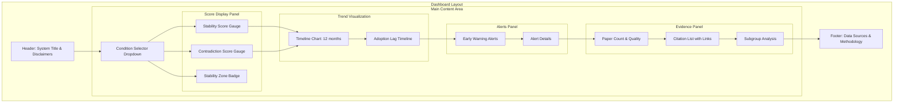

**Frontend displays:**

#### 1. Score Gauges
```
┌─────────────────────────────────────────────────────────────┐
│  Evidence Stability Score                                   │
├─────────────────────────────────────────────────────────────┤
│                                                             │
│                    ╭─────────╮                              │
│                  ╱             ╲                            │
│                ╱                 ╲                          │
│              ╱         85          ╲                        │
│            ╱                         ╲                      │
│          ╱                             ╲                    │
│         │       🟢 STABLE                │                   │
│          ╲                             ╱                    │
│            ╲                         ╱                      │
│              ╲                     ╱                        │
│                ╲                 ╱                          │
│                  ╲             ╱                            │
│                    ╰─────────╯                              │
│                                                             │
│         0────25────50────75────100                          │
│         │    │     │     │     │                            │
│       Sparse High  Emerg Stable                             │
│              Conf  Shift                                    │
│                                                             │
└─────────────────────────────────────────────────────────────┘
```

#### 2. Timeline Trend Graph
```
┌─────────────────────────────────────────────────────────────┐
│  Stability Score Trend (Last 12 Months)                     │
├─────────────────────────────────────────────────────────────┤
│                                                             │
│ 100 ┤                                                       │
│  90 ┤  ●───●───●───●                                        │
│  80 ┤               ╲                                       │
│  70 ┤                ●───●                                  │
│  60 ┤                     ╲                                 │
│  50 ┤                      ●───●  ← Current                 │
│  40 ┤                                                       │
│  30 ┤                                                       │
│  20 ┤                                                       │
│  10 ┤                                                       │
│   0 ┤                                                       │
│     └───────────────────────────────────────────────────   │
│     Jan Feb Mar Apr May Jun Jul Aug Sep Oct Nov Dec         │
│     2024                                        2024        │
│                                                             │
│  Legend:  ● Data point   ─ Trend line                      │
│           ⚠️ Alert triggered at 17 point drop               │
│                                                             │
└─────────────────────────────────────────────────────────────┘
```

#### 3. Early Warning Alerts
```
┌─────────────────────────────────────────────────────────────┐
│  🔴 ACTIVE ALERTS (2)                                       │
├─────────────────────────────────────────────────────────────┤
│                                                             │
│  ⚠️ MEDIUM SEVERITY - Stability Drop                        │
│  Type 2 Diabetes + Metformin                                │
│  Score dropped 17 points in 6 months                        │
│  [View Details] [Dismiss]                                   │
│                                                             │
│  ⚠️ LOW SEVERITY - Contradiction Spike                      │
│  Hypertension + ACE Inhibitors                              │
│  Contradiction score increased 22 points                    │
│  [View Details] [Dismiss]                                   │
│                                                             │
└─────────────────────────────────────────────────────────────┘
```

#### 4. Adoption Lag Timeline
```
┌─────────────────────────────────────────────────────────────┐
│  Adoption Lag Analysis                                      │
├─────────────────────────────────────────────────────────────┤
│                                                             │
│  Research Consensus ──────────────────▶ Clinical Adoption   │
│  January 2020                          July 2022            │
│       │                                     │               │
│       ●─────────────────────────────────────●               │
│                                                             │
│                  30 months lag                              │
│                                                             │
│  Interpretation: Moderate delay between research consensus  │
│  and widespread clinical adoption                           │
│                                                             │
└─────────────────────────────────────────────────────────────┘
```

#### 5. Citation Links
```
┌─────────────────────────────────────────────────────────────┐
│  Supporting Research Papers (47 total)                      │
├─────────────────────────────────────────────────────────────┤
│                                                             │
│  🟢 Positive (38)  🔴 Negative (5)  ⚪ Neutral (4)          │
│                                                             │
│  Recent High-Quality Studies:                               │
│                                                             │
│  1. Smith et al. (2024) - RCT, n=1,200                      │
│     "Efficacy of Metformin in Type 2 Diabetes"              │
│     Outcome: Reduced HbA1c by 1.2%                          │
│     [View on PubMed] [Full Text]                            │
│                                                             │
│  2. Jones et al. (2024) - Meta-analysis, n=5,000            │
│     "Long-term outcomes of Metformin therapy"               │
│     Outcome: Improved cardiovascular outcomes               │
│     [View on PubMed] [Full Text]                            │
│                                                             │
│  [Show All Papers]                                          │
│                                                             │
└─────────────────────────────────────────────────────────────┘
```

**Key Features:**
- Stability Score gauge (0-100 with color coding)
- Contradiction Score chart
- Timeline trend graph (12-month view)
- Early warning alerts (red indicator)
- Adoption lag timeline
- Citation links to PubMed papers
- Responsive design for mobile/desktop
- Prominent safety disclaimers

## Data Models

### Entity Relationship Diagram

```mermaid
erDiagram
    PAPER ||--o{ FINDING : contains
    FINDING }o--|| CONDITION_TREATMENT : belongs_to
    CONDITION_TREATMENT ||--o{ SCORE : has
    CONDITION_TREATMENT ||--o{ ALERT : triggers
    SCORE ||--o{ ALERT : may_generate
    
    PAPER {
        string pubmed_id PK
        string title
        array authors
        date publication_date
        string abstract
        string doi
        string journal
        timestamp retrieved_at
    }
    
    FINDING {
        string condition_treatment PK
        string pubmed_id_timestamp SK
        string outcome
        string direction
        string study_type
        int sample_size
        string confidence
        timestamp extracted_at
    }
    
    CONDITION_TREATMENT {
        string id PK
        string condition
        string treatment
        int paper_count
        timestamp last_updated
    }
    
    SCORE {
        string condition_treatment PK
        date date SK
        float stability_score
        float contradiction_score
        string stability_zone
        int paper_count
        timestamp calculated_at
    }
    
    ALERT {
        string condition_treatment PK
        string alert_id SK
        string alert_type
        string severity
        string message
        timestamp triggered_at
        boolean is_active
    }
```

### Data Model Details

#### 1. Paper Model
```json
{
  "pubmed_id": "12345678",
  "title": "Efficacy of Metformin in Type 2 Diabetes: A Randomized Trial",
  "authors": ["Smith J", "Doe A", "Johnson B"],
  "publication_date": "2024-03-15",
  "abstract": "This randomized controlled trial evaluated...",
  "doi": "10.1234/example.2024.12345",
  "journal": "JAMA",
  "study_type": "RCT",
  "retrieved_at": "2024-12-01T10:30:00Z",
  "processing_status": "completed"
}
```

#### 2. Finding Model
```json
{
  "condition_treatment": "type2diabetes#metformin",
  "pubmed_id": "12345678",
  "timestamp": "2024-12-01T10:35:00Z",
  "condition": "Type 2 Diabetes",
  "treatment": "Metformin",
  "outcome": "Reduced HbA1c by 1.2% (95% CI: 0.9-1.5)",
  "direction": "positive",
  "study_type": "RCT",
  "sample_size": 500,
  "confidence": "high",
  "quality_weight": 1.0,
  "extracted_at": "2024-12-01T10:35:00Z"
}
```

#### 3. Score Model
```json
{
  "condition_treatment": "type2diabetes#metformin",
  "date": "2024-12-01",
  "stability_score": 85.3,
  "contradiction_score": 14.7,
  "stability_zone": "Stable",
  "paper_count": 47,
  "positive_count": 38,
  "negative_count": 5,
  "neutral_count": 4,
  "average_quality": 0.87,
  "average_sample_size": 650,
  "calculated_at": "2024-12-01T11:00:00Z",
  "trend": {
    "1_month_ago": 86.1,
    "3_months_ago": 87.5,
    "6_months_ago": 88.2
  }
}
```

#### 4. Alert Model
```json
{
  "condition_treatment": "type2diabetes#metformin",
  "alert_id": "a1b2c3d4-e5f6-7890-abcd-ef1234567890",
  "alert_type": "stability_drop",
  "severity": "medium",
  "message": "Stability score dropped 17 points in 6 months",
  "triggered_at": "2024-12-01T11:05:00Z",
  "is_active": true,
  "details": {
    "previous_score": 88.2,
    "current_score": 71.1,
    "drop_amount": 17.1,
    "time_period": "6_months",
    "contributing_papers": ["12345678", "87654321", "11223344"]
  }
}
```

### Data Flow Between Models

```
┌──────────────┐
│  PubMed API  │
└──────┬───────┘
       │
       ▼
┌──────────────┐     Store Raw
│  Paper Model │────────────────▶ S3
└──────┬───────┘
       │
       │ Extract with Bedrock
       ▼
┌──────────────┐     Store Structured
│Finding Model │────────────────▶ DynamoDB
└──────┬───────┘
       │
       │ Aggregate & Calculate
       ▼
┌──────────────┐     Store Scores
│ Score Model  │────────────────▶ DynamoDB
└──────┬───────┘
       │
       │ Detect Anomalies
       ▼
┌──────────────┐     Store Alerts
│ Alert Model  │────────────────▶ DynamoDB
└──────────────┘
```

## AI Design (Amazon Bedrock Usage)

### Bedrock Processing Pipeline

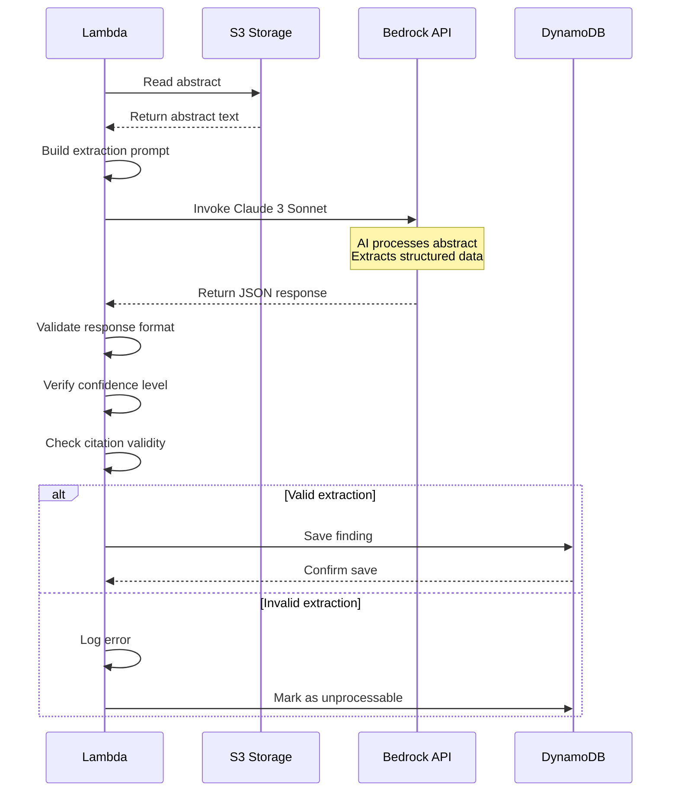

### What Bedrock Does

Amazon Bedrock is used **only** for text extraction. It reads research abstracts and outputs structured JSON data.

**Bedrock's Role:**
```
┌─────────────────────────────────────────────────────────────┐
│  INPUT: Unstructured Text                                   │
├─────────────────────────────────────────────────────────────┤
│                                                             │
│  "This randomized controlled trial evaluated the efficacy   │
│  of metformin in 500 patients with type 2 diabetes. The    │
│  primary outcome was reduction in HbA1c levels. Results    │
│  showed a mean reduction of 1.2% (95% CI: 0.9-1.5, p<0.01) │
│  compared to placebo..."                                    │
│                                                             │
└─────────────────────────────────────────────────────────────┘
                            │
                            │ Bedrock AI Processing
                            ▼
┌─────────────────────────────────────────────────────────────┐
│  OUTPUT: Structured JSON                                    │
├─────────────────────────────────────────────────────────────┤
│  {                                                          │
│    "condition": "Type 2 Diabetes",                          │
│    "treatment": "Metformin",                                │
│    "outcome": "Reduced HbA1c by 1.2%",                      │
│    "direction": "positive",                                 │
│    "study_type": "RCT",                                     │
│    "sample_size": 500,                                      │
│    "confidence": "high"                                     │
│  }                                                          │
└─────────────────────────────────────────────────────────────┘
```

### What Bedrock Does NOT Do

```
❌ Does NOT calculate final scores (backend logic does this)
❌ Does NOT recommend treatments
❌ Does NOT make medical decisions
❌ Does NOT generate new research findings
❌ Does NOT fabricate citations
❌ Does NOT access patient data
```

### Example Bedrock Prompt

```
You are a medical research analyst. Extract structured information from this abstract.

Abstract: [ABSTRACT TEXT]

Extract the following in JSON format:
- condition: The medical condition studied
- treatment: The intervention or treatment
- outcome: The main result reported
- direction: "positive", "negative", or "neutral"
- study_type: "RCT", "meta-analysis", "observational", or "other"
- sample_size: Number of participants (integer)
- confidence: "high", "medium", or "low" based on study design

If information is missing, use null. Do not fabricate data.
```

### Preventing Hallucination

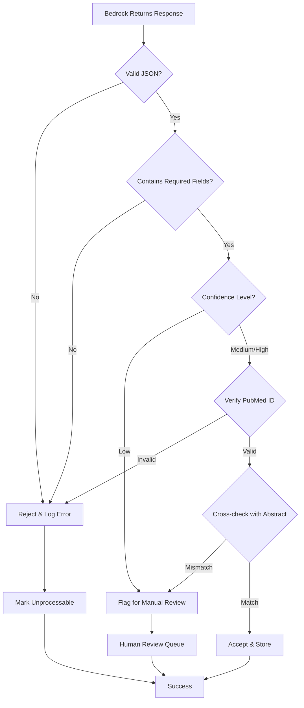

**Safety Measures:**

1. **Citation Verification**
   - Verify PubMed ID exists before storing
   - Cross-reference with PubMed API
   - Reject invalid citations

2. **Confidence Filtering**
   - Only display "medium" or "high" confidence extractions
   - Flag "low" confidence for review
   - Display confidence level to users

3. **Safe Fallback**
   - If extraction fails, mark as "unprocessable" and skip
   - Never display unverified data
   - Log all failures for analysis

4. **No Fabrication**
   - Prompt explicitly instructs not to invent data
   - Use null for missing information
   - Validate against source abstract

5. **Spot Checks**
   - Manually review 10% of extractions for MVP
   - Compare AI output with human expert review
   - Adjust prompts based on findings

## 5. Scoring Logic Design

### Evidence Stability Score

**Simple formula:**
```
Stability Score = (Agreement % × Quality Weight × Recency Factor)
```

**Factors:**
- **Agreement**: % of studies with same direction (positive/negative)
- **Quality**: RCTs weighted higher than observational studies
- **Sample Size**: Larger studies have more influence
- **Recency**: Recent studies (last 2 years) weighted higher

**Example:**
- 8 of 10 studies positive → 80% agreement
- 6 are RCTs → Quality boost
- Average sample size 500 → Moderate
- Published in last 3 years → High recency
- **Final Score: 85 (Stable)**

### Contradiction Score

**Simple formula:**
```
Contradiction Score = (Disagreement % × Quality of Conflicting Studies) × 100
```

**Example:**
- 3 high-quality RCTs say positive
- 2 high-quality RCTs say negative
- **Contradiction Score: 40 (Moderate Conflict)**

### Early Warning Triggers (MVP)

For the hackathon MVP, we implement **2 simple triggers**:

1. **Stability Drop**: Score drops >15 points in 6 months
2. **Contradiction Spike**: Score increases >20 points in 6 months

These are easy to calculate and demonstrate the concept effectively.

## 6. Adoption Lag Logic

### How It Works

1. **Find Research Consensus Date**: When stability score first crossed 70
2. **Find Adoption Date**: When treatment frequency increased significantly in public dataset
3. **Calculate Difference**: Months between these two dates

### Data Source

- **MIMIC-III Demo**: Publicly available anonymized ICU dataset
- **Synthetic Data**: Generated data for demonstration if MIMIC is insufficient
- **Aggregated Only**: Population-level trends, no individual patients

### Handling Uncertainty

- If data incomplete: "Adoption lag cannot be calculated"
- If treatment too new: "Too early to measure adoption"
- If no clear pattern: "Adoption pattern unclear"

## 7. Responsible AI & Safety Design

### Safety Measures

1. **Citation Verification**
   - Every finding links to real PubMed ID
   - Verify ID exists before storing
   - Reject invalid citations

2. **Confidence Thresholds**
   - Only show "medium" or "high" confidence findings
   - Flag "low" confidence for review
   - Display confidence level to users

3. **Safe Fallback Messages**
   - Fewer than 3 studies: "Sparse Evidence - More research needed"
   - High contradictions: "Conflicting Evidence - Interpret with caution"
   - Low quality: "Limited Quality Evidence - Findings uncertain"

4. **Clear Disclaimers**
   - Every page: "This is not a diagnostic or treatment tool"
   - Every page: "Does not replace clinical judgment"
   - Every page: "For research and educational purposes only"

5. **No Diagnostic Language**
   - Use: "Research suggests..." or "Studies indicate..."
   - Avoid: "You should take X" or "diagnosis" or "prescription"

6. **No Patient Data**
   - Only public, anonymized datasets
   - No individual patient records
   - All analysis is population-level

## Error Handling

### Error Handling Strategy

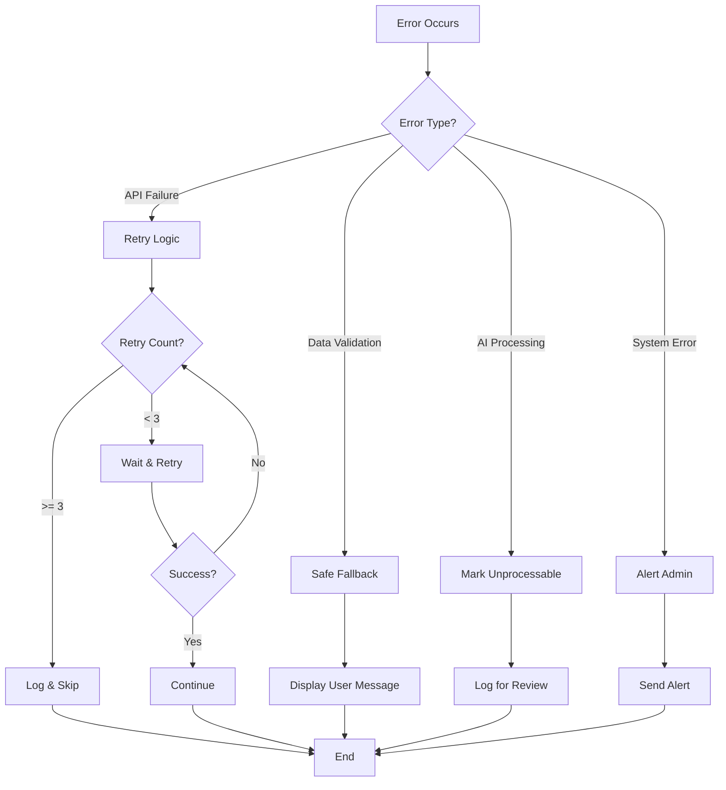

### Edge Case Handling

#### Edge Case 1: Sparse Evidence (Fewer Than 3 Studies)

**Detection:**
```
IF paper_count < 3 THEN
  stability_zone = "Sparse Evidence"
  display_warning = true
END IF
```

**User Display:**
```
┌─────────────────────────────────────────────────────┐
│  ⚠️ SPARSE EVIDENCE                                 │
├─────────────────────────────────────────────────────┤
│                                                     │
│  Only 2 studies found for this condition-treatment  │
│  pair. More research is needed for reliable         │
│  conclusions.                                       │
│                                                     │
│  Available Studies:                                 │
│  1. Smith et al. (2024) - Positive [PubMed Link]   │
│  2. Jones et al. (2023) - Neutral [PubMed Link]    │
│                                                     │
│  💡 Suggestion: Check back later for more research  │
│                                                     │
└─────────────────────────────────────────────────────┘
```

#### Edge Case 2: Conflicting Meta-Analyses

**Detection:**
```
IF meta_analysis_count >= 2 AND 
   meta_analyses_disagree THEN
  contradiction_score = HIGH
  display_both_perspectives = true
END IF
```

**User Display:**
```
┌─────────────────────────────────────────────────────┐
│  ⚠️ CONFLICTING META-ANALYSES                       │
├─────────────────────────────────────────────────────┤
│                                                     │
│  Expert opinion is divided on this treatment        │
│                                                     │
│  Perspective A (Positive):                          │
│  • Meta-analysis by Smith et al. (2024)             │
│  • 15 studies, n=5,000                              │
│  • Conclusion: Effective treatment                  │
│  [View on PubMed]                                   │
│                                                     │
│  Perspective B (Negative):                          │
│  • Meta-analysis by Jones et al. (2024)             │
│  • 12 studies, n=4,200                              │
│  • Conclusion: Limited efficacy                     │
│  [View on PubMed]                                   │
│                                                     │
│  💡 Interpretation: Consult both analyses           │
│                                                     │
└─────────────────────────────────────────────────────┘
```

#### Edge Case 3: Rapidly Increasing Publications

**Detection:**
```
IF publications_last_3_months > 10 THEN
  flag_as_fast_moving = true
  trigger_early_warning = true
  increase_update_frequency = true
END IF
```

**User Display:**
```
┌─────────────────────────────────────────────────────┐
│  🔥 FAST-MOVING FIELD                               │
├─────────────────────────────────────────────────────┤
│                                                     │
│  This area is experiencing rapid research growth    │
│                                                     │
│  Publication Volume:                                │
│  • Last 3 months: 15 new papers                     │
│  • Previous 3 months: 6 papers                      │
│  • Growth rate: 150% increase                       │
│                                                     │
│  📊 Trend Chart:                                    │
│   15 ┤                               ●              │
│   12 ┤                           ●                  │
│    9 ┤                       ●                      │
│    6 ┤               ●   ●                          │
│    3 ┤       ●   ●                                  │
│    0 ┤   ●                                          │
│      └───────────────────────────────────           │
│      Q1  Q2  Q3  Q4  Q1  Q2  Q3  Q4                 │
│      2023            2024                           │
│                                                     │
│  💡 Recommendation: Monitor closely for updates     │
│                                                     │
└─────────────────────────────────────────────────────┘
```

### Fallback Strategy

```
┌─────────────────────────────────────────────────────┐
│  Component Failure Handling                         │
├─────────────────────────────────────────────────────┤
│                                                     │
│  PubMed API Failure:                                │
│  → Retry 3 times with exponential backoff           │
│  → Use cached data if available                     │
│  → Display: "Data temporarily unavailable"          │
│                                                     │
│  Bedrock API Failure:                               │
│  → Retry 3 times                                    │
│  → Mark paper as "pending processing"               │
│  → Continue with other papers                       │
│                                                     │
│  DynamoDB Failure:                                  │
│  → Retry with exponential backoff                   │
│  → Queue operation for later                        │
│  → Alert system admin                               │
│                                                     │
│  Scoring Calculation Error:                         │
│  → Log error details                                │
│  → Use previous score if available                  │
│  → Display: "Score calculation in progress"         │
│                                                     │
│  Dashboard Load Failure:                            │
│  → Display cached data                              │
│  → Show "Last updated" timestamp                    │
│  → Provide manual refresh option                    │
│                                                     │
└─────────────────────────────────────────────────────┘
```

## Testing Strategy

### Testing Pyramid

```
                    ▲
                   ╱ ╲
                  ╱   ╲
                 ╱ E2E ╲              5 tests
                ╱───────╲
               ╱         ╲
              ╱Integration╲           15 tests
             ╱─────────────╲
            ╱               ╲
           ╱  Unit Tests     ╲        50 tests
          ╱___________________╲
```

### Test Coverage by Component

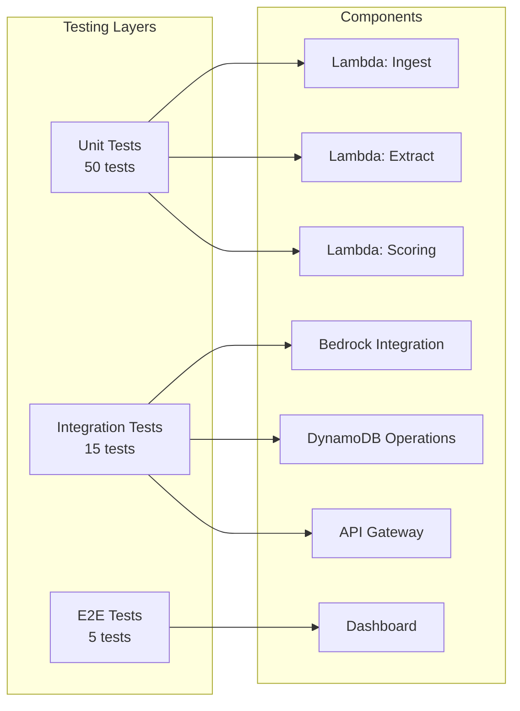

### Unit Tests (50 tests)

**Lambda: Ingest (15 tests)**
- ✓ Query PubMed API successfully
- ✓ Handle API timeout
- ✓ Validate paper metadata
- ✓ Store to S3 correctly
- ✓ Handle malformed responses
- ✓ Retry logic works correctly
- ✓ Error logging functions
- ✓ Duplicate detection
- ✓ Date parsing edge cases
- ✓ Author list formatting
- ✓ Abstract truncation
- ✓ DOI validation
- ✓ Journal name normalization
- ✓ Batch processing
- ✓ Memory management

**Lambda: Extract (15 tests)**
- ✓ Read from S3 successfully
- ✓ Build Bedrock prompt correctly
- ✓ Parse Bedrock response
- ✓ Validate JSON structure
- ✓ Handle missing fields
- ✓ Confidence level classification
- ✓ Citation verification
- ✓ Direction classification logic
- ✓ Study type detection
- ✓ Sample size extraction
- ✓ Handle null values
- ✓ Error handling for invalid JSON
- ✓ Timeout handling
- ✓ Retry logic
- ✓ Save to DynamoDB

**Lambda: Scoring (20 tests)**
- ✓ Calculate stability score correctly
- ✓ Calculate contradiction score correctly
- ✓ Classify stability zones
- ✓ Detect early warnings
- ✓ Handle sparse evidence
- ✓ Weight quality factors
- ✓ Apply recency factors
- ✓ Sample size weighting
- ✓ Agreement rate calculation
- ✓ Trend analysis
- ✓ Alert generation
- ✓ Severity classification
- ✓ Historical comparison
- ✓ Edge case: all positive studies
- ✓ Edge case: all negative studies
- ✓ Edge case: exactly 3 studies
- ✓ Edge case: very old studies
- ✓ Edge case: very large sample sizes
- ✓ Adoption lag calculation
- ✓ Save results to DynamoDB

### Integration Tests (15 tests)

**Bedrock Integration (5 tests)**
- ✓ End-to-end extraction pipeline
- ✓ Handle Bedrock API errors
- ✓ Validate extracted data quality
- ✓ Citation verification workflow
- ✓ Confidence filtering

**DynamoDB Operations (5 tests)**
- ✓ Write and read papers
- ✓ Write and read findings
- ✓ Write and read scores
- ✓ Query by condition-treatment
- ✓ Update existing records

**API Gateway (5 tests)**
- ✓ GET /conditions endpoint
- ✓ GET /conditions/{id}/scores endpoint
- ✓ GET /warnings endpoint
- ✓ Authentication flow
- ✓ Error responses

### End-to-End Tests (5 tests)

**Complete Workflows**
- ✓ Ingest → Extract → Score → Display
- ✓ Early warning detection flow
- ✓ Dashboard load and interaction
- ✓ Citation link verification
- ✓ Error recovery scenarios

### Property-Based Tests

**Correctness Properties** (to be defined in next section)

### Manual Testing Checklist

```
□ Verify PubMed citations are real
□ Check disclaimer visibility on all pages
□ Test with 3-5 condition-treatment pairs
□ Validate score calculations manually
□ Review AI extraction accuracy (10% sample)
□ Test error messages are user-friendly
□ Verify HTTPS on all endpoints
□ Check mobile responsiveness
□ Test authentication flow
□ Validate adoption lag calculations
```

## 9. Security & Privacy Design

### Data Privacy

- **Public data only**: PubMed papers are publicly available
- **No PII**: Never collect names, addresses, or identifiers
- **Anonymized datasets**: MIMIC-III Demo is pre-anonymized
- **No EHR access**: System does not connect to hospital databases

### Security Measures

1. **HTTPS**: All API calls encrypted
2. **Authentication**: API requires tokens
3. **IAM Roles**: Lambda uses least-privilege roles
4. **Input Validation**: Sanitize all user inputs
5. **Encryption**: DynamoDB encryption at rest

### AWS Best Practices

- S3 buckets are private
- API Gateway requires API keys
- CloudWatch logs for audit trail
- No public endpoints

## 10. MVP Constraints

### Included in Hackathon MVP

✅ 3-5 condition-treatment pairs
✅ PubMed data ingestion
✅ Amazon Bedrock extraction
✅ Stability and contradiction scoring
✅ 2 early warning triggers
✅ Simple web dashboard
✅ Basic REST API
✅ Adoption lag (using MIMIC Demo or synthetic data)

### NOT Included (Out of Scope)

❌ Real-time updates (monthly only)
❌ EHR integration
❌ Mobile app
❌ User accounts
❌ Advanced ML predictions
❌ Production-grade security
❌ Comprehensive testing

### Hackathon Realities

- **Preprocessed data OK**: Can use pre-downloaded PubMed data
- **Proof of concept**: Show it works, not production-ready
- **Manual setup**: Judges understand this is a prototype
- **Simple UI**: Clean and functional

### Success Criteria

1. Ingest and process PubMed papers
2. Bedrock extracts structured data accurately
3. Scores calculated and displayed correctly
4. Dashboard shows at least 1 early warning example
5. Adoption lag calculated for at least 1 condition
6. All citations link to real PubMed papers
7. Disclaimers prominently displayed

## Correctness Properties

### What Are Correctness Properties?

A property is a characteristic or behavior that should hold true across all valid executions of a system—essentially, a formal statement about what the system should do. Properties serve as the bridge between human-readable specifications and machine-verifiable correctness guarantees.

In this system, correctness properties define universal rules that must hold for all inputs, ensuring the system behaves correctly across all scenarios. These properties will be implemented as property-based tests that validate system behavior through randomized testing.

### Core System Properties

#### Property 1: Data Ingestion Completeness
*For any* successfully retrieved research paper from PubMed, the stored S3 object should contain all required metadata fields (title, authors, publication_date, abstract, DOI).

**Validates: Requirements 1.2, 1.3**

#### Property 2: Extraction Round-Trip Consistency
*For any* research paper abstract that is successfully processed, extracting and then storing to DynamoDB and then retrieving should produce equivalent structured data.

**Validates: Requirements 2.3**

#### Property 3: Citation Integrity
*For any* extracted finding or displayed result, the associated PubMed ID should reference a real, verifiable research paper.

**Validates: Requirements 2.5, 11.1, 11.4, 11.5**

#### Property 4: Score Boundary Constraints
*For any* calculated Evidence_Stability_Score or Contradiction_Score, the value should be between 0 and 100 (inclusive).

**Validates: Requirements 4.5**

#### Property 5: Agreement Monotonicity
*For any* set of research papers, if the proportion of papers with the same direction increases, the Evidence_Stability_Score should not decrease (assuming other factors remain constant).

**Validates: Requirements 4.1**

#### Property 6: Quality Weighting
*For any* two sets of papers with identical agreement rates, the set with higher average study quality (more RCTs) should have a higher or equal Evidence_Stability_Score.

**Validates: Requirements 4.2**

#### Property 7: Sample Size Influence
*For any* two sets of papers with identical agreement rates and quality, the set with larger average sample sizes should have a higher or equal Evidence_Stability_Score.

**Validates: Requirements 4.3**

#### Property 8: Recency Weighting
*For any* two sets of papers with identical agreement, quality, and sample sizes, the set with more recent publications should have a higher or equal Evidence_Stability_Score.

**Validates: Requirements 4.4**

#### Property 9: Contradiction Detection
*For any* set of research papers where at least one paper has an opposite direction from the majority, the Contradiction_Score should be greater than zero.

**Validates: Requirements 3.1, 3.2**

#### Property 10: Stability Zone Classification Consistency
*For any* Evidence_Stability_Score above 80, the Stability_Zone should be classified as "Stable".

**Validates: Requirements 7.2**

#### Property 11: Sparse Evidence Detection
*For any* Condition_Treatment_Pair with fewer than 5 research papers, the Stability_Zone should be classified as "Sparse Evidence".

**Validates: Requirements 7.5, 8.2**

#### Property 12: Early Warning Trigger - Stability Drop
*For any* Condition_Treatment_Pair where the Evidence_Stability_Score drops by more than 15 points within 6 months, an Early_Warning_Signal should be generated.

**Validates: Requirements 9.4**

#### Property 13: Early Warning Trigger - Contradiction Spike
*For any* Condition_Treatment_Pair where the Contradiction_Score increases by more than 20 points within 6 months, an Early_Warning_Signal should be generated.

**Validates: Requirements 9.1**

#### Property 14: Adoption Lag Format
*For any* successfully calculated Adoption_Lag, the result should be expressed as a time duration in months (positive integer).

**Validates: Requirements 6.4**

#### Property 15: API Response Completeness
*For any* valid API query for a Condition_Treatment_Pair, the response should include Evidence_Stability_Score, Contradiction_Score, and Stability_Zone fields.

**Validates: Requirements 16.2**

#### Property 16: Authentication Enforcement
*For any* API request without a valid authentication token, the system should return an HTTP 401 error.

**Validates: Requirements 19.1, 19.4, 19.5**

#### Property 17: Error Resilience
*For any* batch of research papers where some fail to process, the system should continue processing the remaining papers and not halt completely.

**Validates: Requirements 1.4, 2.4, 20.5**

#### Property 18: Retry Logic
*For any* failed processing operation, the system should retry up to 3 times before marking as failed.

**Validates: Requirements 15.2**

#### Property 19: Response Time Constraint
*For any* single Condition_Treatment_Pair query, the system should respond within 10 seconds.

**Validates: Requirements 15.3, 21.1**

#### Property 20: Cache Consistency
*For any* frequently accessed result, querying twice within 24 hours should return the same data (from cache).

**Validates: Requirements 21.4**

#### Property 21: No PII Storage
*For any* data stored in the system (S3, DynamoDB), it should not contain patterns matching personally identifiable information (names, addresses, phone numbers, SSNs).

**Validates: Requirements 14.5**

#### Property 22: Fast-Moving Field Detection
*For any* Condition_Treatment_Pair with more than 10 papers published in the last 3 months, the system should flag it as "Fast-Moving Field".

**Validates: Requirements 20.3**

#### Property 23: Conflicting Meta-Analyses Display
*For any* Condition_Treatment_Pair with 2 or more meta-analyses that disagree, the system should display both perspectives with citations.

**Validates: Requirements 20.2**

#### Property 24: Safe Fallback Messaging
*For any* Condition_Treatment_Pair with fewer than 3 papers, the system should display a "Sparse Evidence" message.

**Validates: Requirements 12.2, 20.1**

#### Property 25: Warning Display for High Contradictions
*For any* Condition_Treatment_Pair with a Contradiction_Score above a threshold (e.g., 60), the system should display a warning about conflicting evidence.

**Validates: Requirements 12.3**

### Property Testing Strategy

All properties listed above will be implemented as property-based tests using an appropriate testing library for the chosen implementation language (e.g., Hypothesis for Python, fast-check for TypeScript/JavaScript, QuickCheck for Haskell).

Each property test will:
- Run a minimum of 100 iterations with randomized inputs
- Be tagged with the property number and description
- Reference the specific requirements it validates
- Include clear failure messages that explain what property was violated

**Example Test Tag Format:**
```
Feature: clinical-evidence-monitoring, Property 1: Data Ingestion Completeness
```

### Unit Test Coverage

In addition to property-based tests, unit tests will cover:
- Specific edge cases (empty inputs, boundary values)
- Integration points between components
- Error handling scenarios
- UI display requirements (disclaimers, citations)

The combination of property-based tests (validating universal rules) and unit tests (validating specific examples) provides comprehensive coverage of system correctness.

## 11. Development with Amazon Q

### How Amazon Q Helps

During development, Amazon Q assists with:
- Generating Lambda function code
- Writing Bedrock prompts
- Debugging API Gateway configurations
- Optimizing DynamoDB queries
- Creating frontend components
- Troubleshooting AWS service integrations

### Example Use Cases

- "Generate a Lambda function to query PubMed API"
- "Write a Bedrock prompt to extract medical study data"
- "Debug this DynamoDB query error"
- "Optimize this scoring algorithm"

---

## Summary

This design provides a practical blueprint for a hackathon MVP that demonstrates clinical evidence monitoring using AWS services. The system uses Amazon Bedrock for text extraction, Lambda for processing, and DynamoDB for storage. It calculates evidence stability scores, detects contradictions, and provides early warnings when consensus may be shifting.

The design prioritizes responsible AI with citation verification, confidence thresholds, and clear disclaimers. It's scoped for a hackathon with 3-5 condition-treatment pairs and focuses on demonstrating core functionality.

**Key Takeaway**: This is a research monitoring tool that tracks trends in medical literature. It does NOT diagnose, treat, or replace clinical judgment.
